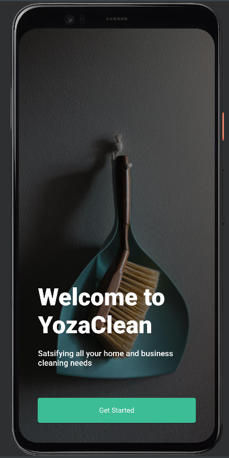
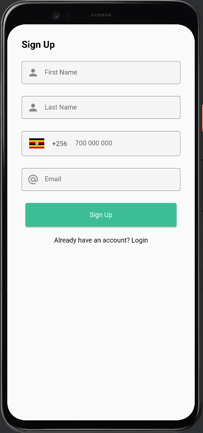
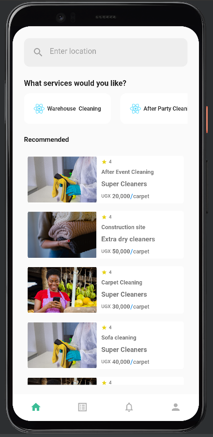
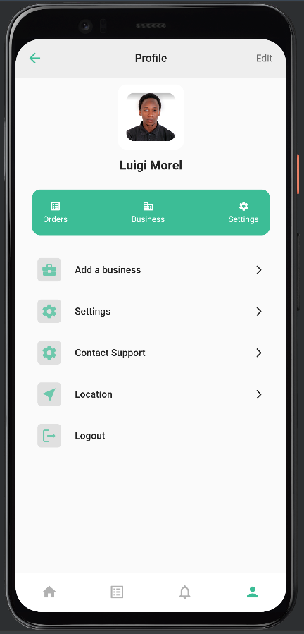
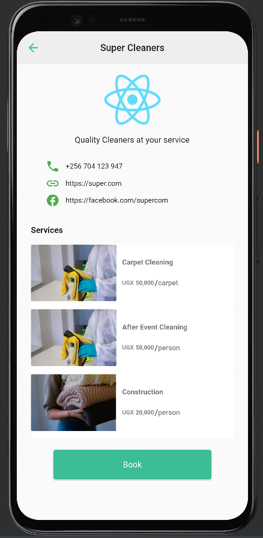
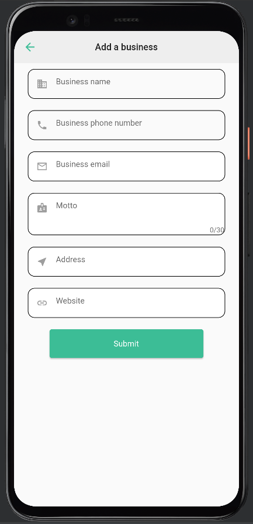
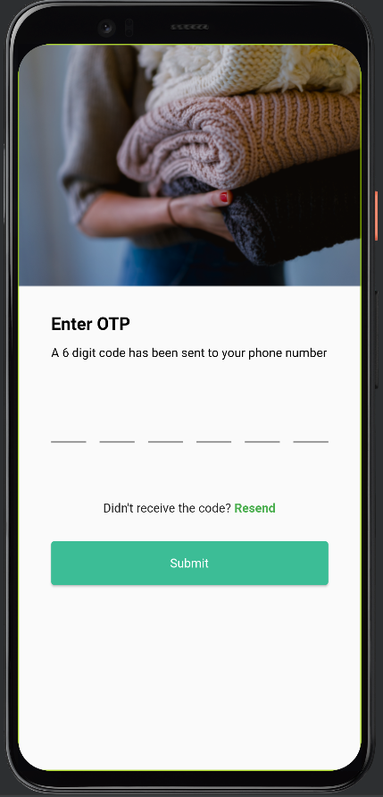
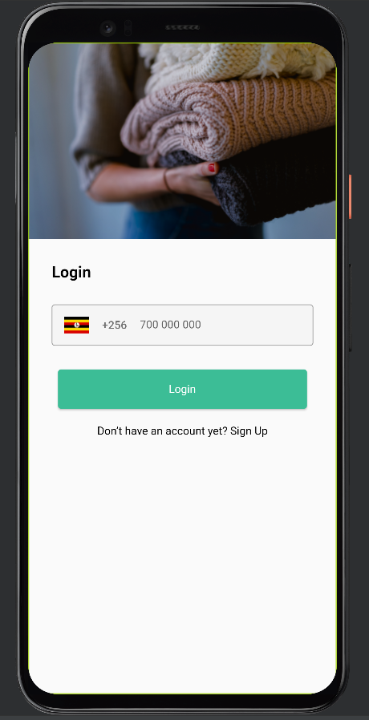

# YozaClean

YozaClean is/was meant to be a B2B mobile application connecting cleaning businesses to customers. It's incomplete at the moment.
If you'd like to own the project, see the `TO DO` section at the bottom

## My role

- Backend developer
- UI designer
- Web developer
- Product / business owner 🤣

## Screeshots

---

 

Below are the user stories that have been guiding the development.

### User stories:

    As a user:
            - I should be able to find cleaning businesses within 5km radius from my preferred location
            - I should see the various cleaning businesses with the different services they offer
            - Book a slot at my preferred business

    As a business owner:
            - I should be able to register my business
            - View and accept bookings from customers
            - List the services offered by my business
            - Edit my business details

### Tools

- Go
- Docker
- Gorilla Mux
- Firebase
- Postgres/POSTGIS
- Next.js
- Tailwind.css
- Typescript
- Dart/Flutter

### Why am I leaving the project?

I want to focus on job hunting. I know the market is crazy right now but if you know anyone hiring a fullstack engineer(Javascript/Typescript - React, Node, Next, Nest, Go), please let me know via morelmiles[at]gmail[dot]com.

### TO DO

- [] Add Firebase Phone Auth
- [] Copy writing for the landing page
- [] Add business mode switcher to the mobile app
- [] Make the interfaces more user friendly
- [] Add GIS searching
- [] Add the admin panel for user and business management
- [] Add admin/user management routes
