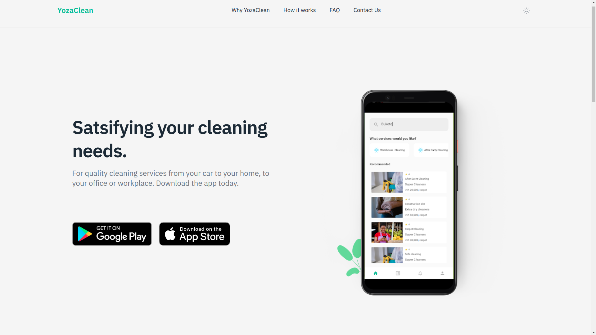

# Website for the YozaClean

---



## Setup instructions

1. `cd` into the project folder and install the dependencies

```bash
yarn

or

npm install

```

2. Start the dev server

```bash
yarn dev

or

npm run dev

```
